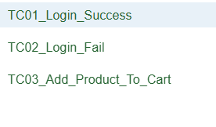
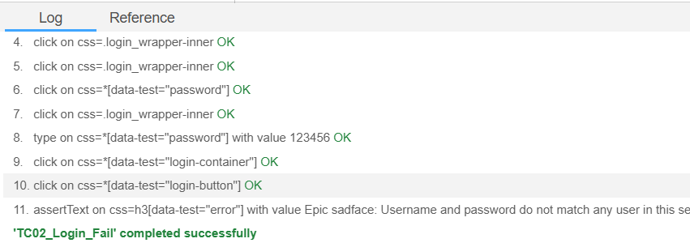
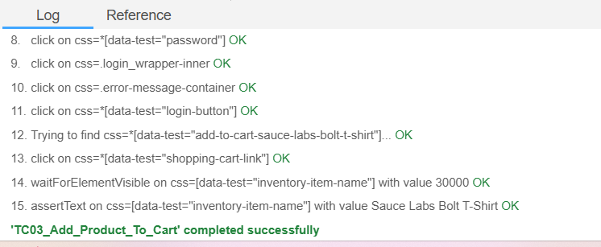
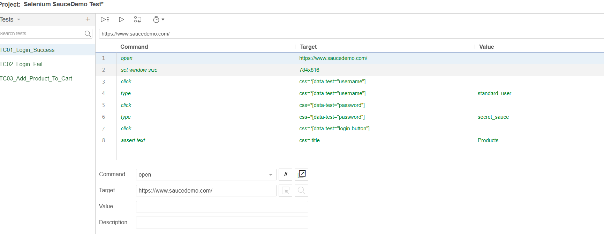

# Báo cáo thực hành kiểm thử Selenium

## 1. Thông tin bài thực hành

* Họ và tên: Ngô Thị Thùy Trang
* Công cụ kiểm thử: Selenium IDE
* Website kiểm thử: https://www.saucedemo.com/
* Trình duyệt sử dụng: Microsoft Edge
* Số lượng test case: 03 test case

## 2. Giới thiệu công cụ Selenium

Selenium là một công cụ kiểm thử tự động được sử dụng phổ biến trong kiểm thử ứng dụng web. Công cụ này cho phép người kiểm thử tự động hóa các thao tác trên trình duyệt như mở website, nhập dữ liệu, nhấn nút, chuyển trang và kiểm tra kết quả hiển thị.

Trong bài thực hành này, em sử dụng Selenium IDE để ghi lại các thao tác kiểm thử trên website SauceDemo. Selenium IDE có giao diện trực quan, hỗ trợ record thao tác của người dùng và chạy lại các thao tác đó để kiểm tra chức năng của website một cách tự động.

## 3. Mục tiêu thực hành

* Tìm hiểu công cụ kiểm thử Selenium.
* Biết cách sử dụng Selenium IDE để tạo test case tự động.
* Xây dựng tối thiểu 03 test case kiểm thử tự động cho một website.
* Kiểm thử các chức năng cơ bản của website như đăng nhập thành công, đăng nhập thất bại và thêm sản phẩm vào giỏ hàng.
* Lưu sản phẩm thực hành lên GitHub để nộp bài.

## 4. Website được kiểm thử

Website được sử dụng để thực hành kiểm thử là:

https://www.saucedemo.com/

Đây là website demo thương mại điện tử, có các chức năng cơ bản như đăng nhập, xem danh sách sản phẩm, thêm sản phẩm vào giỏ hàng và xem giỏ hàng.

## 5. Công cụ và môi trường thực hiện

| Thành phần         | Nội dung                       |
| ------------------ | ------------------------------ |
| Công cụ kiểm thử   | Selenium IDE                   |
| Trình duyệt        | Microsoft Edge                 |
| Website kiểm thử   | SauceDemo                      |
| File test          | selenium-saucedemo-test.side   |
| Hình thức kiểm thử | Kiểm thử tự động giao diện web |

## 6. Danh sách test case

| Mã test case | Tên test case              | Dữ liệu kiểm thử                                    | Kết quả mong đợi                   |
| ------------ | -------------------------- | --------------------------------------------------- | ---------------------------------- |
| TC01         | Đăng nhập thành công       | Username: `standard_user`, Password: `secret_sauce` | Hệ thống chuyển đến trang Products |
| TC02         | Đăng nhập thất bại         | Username: `standard_user`, Password: `123456`       | Hệ thống hiển thị thông báo lỗi    |
| TC03         | Thêm sản phẩm vào giỏ hàng | Sản phẩm: `Sauce Labs Bolt T-Shirt`                 | Sản phẩm xuất hiện trong giỏ hàng  |

## 7. Mô tả chi tiết test case

### 7.1. TC01 - Đăng nhập thành công

Các bước thực hiện:

1. Mở website https://www.saucedemo.com/
2. Nhập username là `standard_user`
3. Nhập password là `secret_sauce`
4. Nhấn nút Login
5. Kiểm tra tiêu đề trang hiển thị là `Products`

Kết quả mong đợi: Người dùng đăng nhập thành công và được chuyển đến trang danh sách sản phẩm.

Kết quả thực tế: Test case chạy thành công.

---

### 7.2. TC02 - Đăng nhập thất bại

Các bước thực hiện:

1. Mở website https://www.saucedemo.com/
2. Nhập username là `standard_user`
3. Nhập password sai là `123456`
4. Nhấn nút Login
5. Kiểm tra thông báo lỗi được hiển thị

Kết quả mong đợi: Hệ thống không cho đăng nhập và hiển thị thông báo lỗi.

Kết quả thực tế: Test case chạy thành công.

---

### 7.3. TC03 - Thêm sản phẩm vào giỏ hàng

Các bước thực hiện:

1. Mở website https://www.saucedemo.com/
2. Đăng nhập bằng tài khoản hợp lệ
3. Chọn sản phẩm `Sauce Labs Bolt T-Shirt`
4. Nhấn nút Add to cart
5. Mở giỏ hàng
6. Kiểm tra sản phẩm đã có trong giỏ hàng

Kết quả mong đợi: Sản phẩm `Sauce Labs Bolt T-Shirt` được thêm vào giỏ hàng thành công.

Kết quả thực tế: Test case chạy thành công.

## 8. Minh chứng thực nghiệm
 
### 8.1. Danh sách test case trong Selenium IDE



### 8.2. Kết quả chạy TC01 - Đăng nhập thành công



### 8.3. Kết quả chạy TC03 - Thêm sản phẩm vào giỏ hàng



### 8.4. Kết quả chạy toàn bộ test case



## 9. Kết quả thực nghiệm

Sau khi chạy các test case bằng Selenium IDE, cả 03 test case đều chạy thành công.

| Mã test case | Tên test case              | Kết quả |
| ------------ | -------------------------- | ------- |
| TC01         | Đăng nhập thành công       | Passed  |
| TC02         | Đăng nhập thất bại         | Passed  |
| TC03         | Thêm sản phẩm vào giỏ hàng | Passed  |

Kết quả tổng quan:

```text
Runs: 3
Failures: 0
```

## 10. Nhận xét

Qua quá trình thực hành, em đã hiểu cách sử dụng Selenium IDE để tạo các test case kiểm thử tự động cho website. Selenium IDE giúp ghi lại thao tác của người dùng trên trình duyệt và chạy lại các thao tác đó để kiểm tra chức năng của hệ thống.

Công cụ Selenium IDE phù hợp với người mới bắt đầu học kiểm thử tự động vì có giao diện trực quan, dễ sử dụng và không cần viết quá nhiều mã nguồn. Các thao tác như nhập dữ liệu, nhấn nút, kiểm tra nội dung hiển thị đều có thể được ghi lại và chạy lại tự động.

## 11. Kết luận

Bài thực hành đã hoàn thành yêu cầu tìm hiểu công cụ kiểm thử Selenium và xây dựng tối thiểu 03 test case kiểm thử tự động cho một website.

Các test case đã kiểm thử được những chức năng cơ bản gồm đăng nhập thành công, đăng nhập thất bại và thêm sản phẩm vào giỏ hàng. Kết quả thực nghiệm cho thấy cả 03 test case đều chạy thành công, đáp ứng đúng kết quả mong đợi. Qua bài thực hành này, em hiểu rõ hơn vai trò của Selenium trong kiểm thử tự động giao diện web.
